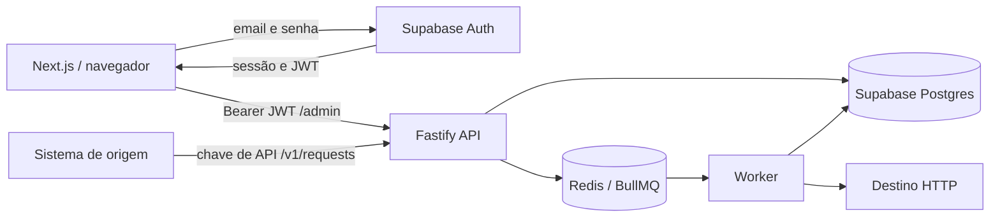

# Análise da estrutura e do loop de autenticação

Data: 22/09/2026.

## Escopo e limites

Inventário dos arquivos próprios do projeto, revisão dos módulos de código de web/API/worker/shared, contratos entre telas e rotas, migração SQL, manifests, configurações de execução e Docker. Estilos foram verificados quanto a referências de classes e animações relacionadas ao sintoma; documentos de etapas foram confrontados com a implementação. Dependências instaladas, `.git`, caches e saídas geradas não representam código próprio e ficaram fora da revisão estrutural. Arquivos de ambiente foram comparados sem reproduzir seus valores neste relatório.

Esta análise não equivale a validar todos os fluxos em produção. O login com uma sessão real do usuário e o processamento completo de uma requisição externa ainda precisam de validação em execução. Não foram aplicadas migrações nem alterados dados no Supabase.

## Estrutura atual

| Área | Responsabilidade | Arquivos revisados |
| --- | --- | --- |
| Raiz | Workspaces npm e execução | `package.json`, `tsconfig.json`, `.gitignore`, `docker-compose.yml`, arquivos de ambiente e documentação de etapas |
| Web | Next.js Pages Router, interface e sessão Supabase | `pages/*`, `pages/requests/[id].tsx`, `components/*`, `lib/*`, `styles/*`, manifests, configuração Next/TypeScript/ESLint, Dockerfile |
| API | Fastify, JWT administrativo, chaves de integração, persistência e fila | `server.ts`, `middleware/*`, `routes/*`, `services/*`, `lib/supabase-client.ts`, manifests e configurações |
| Worker | Consumo BullMQ, encaminhamento HTTP, limites e reconciliação | `worker.ts`, `processors/request-processor.ts`, `services/rate-limiting.ts`, `services/reconciliation.ts`, manifests e configurações |
| Shared | Tipos, erros, configuração, validação, limites e logs | Todos os módulos de `packages/shared/src` e manifests |
| Banco | Tabelas, índices e RLS | `supabase/migrations/001_initial_schema.sql` |

## Causa da alternância entre login e dashboard

O fluxo anterior era:

1. O Supabase autenticava e persistia uma sessão no navegador.
2. O dashboard enviava o access token para a API.
3. `jwt-auth.ts` tentava verificar qualquer token com `SUPABASE_JWT_SECRET` convertido em bytes.
4. A API respondia 401.
5. `web/src/lib/api.ts` fazia `window.location.href = '/login'`, sem encerrar a sessão.
6. `login.tsx` encontrava a mesma sessão e retornava ao dashboard.
7. As chamadas do dashboard repetiam o ciclo.

O endpoint público JWKS do projeto configurado respondeu HTTP 200 e publicou chave **ES256/EC**. A implementação anterior não suportava esse algoritmo. Não foi capturado o token real do navegador; portanto, sua assinatura específica não foi inspecionada. A incompatibilidade do verificador com as chaves publicadas e o ciclo de redirecionamento são verificáveis independentemente.

A documentação oficial descreve a verificação de ES256/RS256 pelo JWKS e o fluxo legado HS256: [Supabase JWTs](https://supabase.com/docs/guides/auth/jwts).

## Correções aplicadas

| Correção | Arquivos |
| --- | --- |
| ES256/RS256 pelo JWKS do projeto configurado, com cache; suporte legado HS256 restrito ao algoritmo correspondente | `apps/api/src/middleware/jwt-auth.ts` |
| Validação de emissor, audiência autenticada e claims obrigatórias; preservação da autorização de administrador | `apps/api/src/middleware/jwt-auth.ts` |
| Encerrar sessão local antes de redirecionar em 401; agrupar respostas simultâneas em um único encerramento/redirecionamento | `apps/web/src/lib/supabase.ts`, `apps/web/src/lib/api.ts` |
| Mensagem de sessão recusada no login, navegação com `replace` e remoção da espera artificial de 500 ms | `apps/web/src/pages/login.tsx` |
| Ajuste das dependências dos efeitos de autenticação e cancelamento da verificação do login após desmontagem | `apps/web/src/pages/login.tsx`, `apps/web/src/lib/withAuth.tsx` |
| Carregar `.env` raiz antes dos módulos dependentes, usando caminho baseado no arquivo e não no diretório de execução | `apps/api/src/env.ts`, `apps/worker/src/env.ts` e respectivos pontos de entrada |
| Criar cliente Redis de health durante registro de rotas, limitar espera, tratar erros e desconectar no fechamento | `apps/api/src/routes/health.ts` |
| Tratar erros de conexão da fila de retry; limitar repetição do aviso da conexão Redis e corrigir argumentos dos logs | `apps/api/src/routes/admin-requests.ts` |
| Corrigir tipagem do cliente Supabase, eliminando erros implícitos nas métricas | `apps/api/src/lib/supabase-client.ts` |
| Implementar função `toggleDestination`, que a tela importava mas não existia | `apps/web/src/lib/api.ts` |
| Aceitar respostas 204 sem tentar interpretar corpo JSON; propagar 401 do health e não informar API online quando sua consulta falha | `apps/web/src/lib/api.ts` |
| Substituir credenciais reais do arquivo de exemplo por placeholders; documentar segredo JWT legado | `.env.example` |
| Escapar apóstrofos em texto JSX que bloqueavam o build | `apps/web/src/pages/api-keys.tsx`, `apps/web/src/pages/requests/[id].tsx` |

Os arquivos de ambiente ativos não foram alterados. Alterações que já estavam no workspace foram preservadas.

## Ambiente e Redis

- API e worker usam `.env` na raiz. `apps/api/.env` não é a fonte carregada por esses pontos de entrada.
- O Next.js executado no workspace web usa `apps/web/.env.local`. Os arquivos `.env.local` da raiz não são carregados automaticamente como configuração desse workspace.
- URLs e chaves públicas Supabase comparadas entre os arquivos existentes correspondem ao mesmo projeto.
- `env.local`, sem ponto inicial, não foi encontrado no disco durante a inspeção; uma aba do editor pode existir sem arquivo salvo.
- O Redis configurado aponta para localhost. O teste TCP retornou `ECONNREFUSED`.
- O executável Docker existe, mas o daemon Docker Desktop não respondeu: pipe `dockerDesktopLinuxEngine` ausente.
- O serviço Redis do Compose não configura usuário/senha, enquanto o `.env` ativo contém essas credenciais. Para usar esse Redis local, é necessário alinhar a autenticação: usuário/senha vazios no ambiente local ou ACL equivalente no servidor. Apenas ligar um Redis diferente sem alinhar isso pode trocar o erro de conexão por erro de autenticação.

O painel pode carregar dados do banco com Redis offline; enfileiramento e processamento dependem dele. O conserto do loop não cria nem inicia um servidor Redis.

## Pendências estruturais encontradas

Estas pendências foram analisadas, mas não foram convertidas em uma reescrita de todos os subsistemas nesta correção de autenticação.

| Prioridade | Local | Evidência e efeito |
| --- | --- | --- |
| Alta | `routes/api-keys.ts`, `services/auth.ts`, `web/pages/api-keys.tsx` | Rotas administrativas leem `request.sourceId`, mas o middleware JWT define `userId`/`userEmail`. A tela solicita `source_id`, mas o cliente não o envia. Listagem, criação e revogação precisam de um contrato explícito de origem. |
| Alta | `worker/processors/request-processor.ts` | O singleton é construído com `new RequestProcessor()` sem Redis; o serviço de rate limiting fica nulo. Os limites implementados não são ativados nesse caminho de execução. |
| Alta | `worker/services/reconciliation.ts`, migração SQL | A reconciliação filtra/ordena por `requests.updated_at`, ausente na migração disponível. Um banco criado apenas por essa migração não atende à consulta. O esquema remoto não foi inspecionado. |
| Alta | `shared/validation.ts` | A verificação de IP privado compara apenas o primeiro octeto com intervalos invertidos para 172/192; não cobre corretamente 172.16/12 e 192.168/16. Também faltam validação de resolução DNS e proteção dos redirecionamentos seguidos pelo cliente HTTP. |
| Alta | Dockerfiles e Compose | Dockerfiles assumem saídas na raiz (`/app/dist`, `/app/.next`), mas os builds são por workspace. O Compose web usa `NEXT_PUBLIC_API_BASE_URL`, enquanto o cliente lê `NEXT_PUBLIC_API_URL`, e não fornece toda a configuração pública Supabase. A API não recebe `ADMIN_USER_ID` no Compose. |
| Alta | `middleware/jwt-auth.ts` | Se `ADMIN_USER_ID` estiver ausente, a condição atual permite qualquer usuário autenticado com JWT válido do projeto. O ambiente local contém o identificador; a política precisa falhar de forma explícita em ambientes onde ele faltar. |
| Alta | `.env.example` e distribuição do projeto | O exemplo continha credenciais reais. Foi sanitizado. Se o arquivo foi compartilhado ou versionado com esses valores, substituir o exemplo não revoga os segredos: a rotação deve ser feita nos provedores. |
| Média | `routes/admin-requests.ts` | O frontend envia `offset`, mas a rota usa `page`; a paginação pode repetir a primeira página. |
| Média | `routes/admin-requests.ts` | O retry enfileira apenas IDs, sem payload/headers/método originais; incrementa tentativas antes de enviar e pode informar sucesso mesmo após falha de enfileiramento. Job existente com o mesmo ID precisa de tratamento explícito. |
| Média | `services/requests.ts`, reconciliação | Headers e método recebidos são enviados ao primeiro job, mas não persistidos no insert, embora haja colunas no SQL. Reconciliação/retry não preservam integralmente a requisição original. |
| Média | `worker.ts`, fila e processor | A fila principal fixa três tentativas e não usa `destination.max_attempts`. O caminho de adiamento usa `require` em módulo ESM. Esgotamento das tentativas precisa sincronizar status final no banco. |
| Média | Health e worker | O health consulta `worker:heartbeat`, mas o worker não escreve essa chave. O status pode ficar offline mesmo com worker executando. |
| Média | `components/Sidebar.tsx` | API/Redis/Worker aparecem online por constantes, sem consulta. Isso pode contradizer os cards do dashboard. |
| Média | `pages/settings.tsx` e consumidores | Preferências são salvas no localStorage, mas URL da API, intervalo de atualização e tema não são consumidos de modo consistente. A URL padrão da tela diverge da URL usada pelo cliente. |
| Média | `api-keys` e tipos | A API devolve datas em camelCase, enquanto a tela lê snake_case. `key_prefix` é exibido, mas não é armazenado nem retornado. |
| Média | `services/requests.ts`, SQL | A chave de idempotência é global e a consulta não filtra por origem. Sistemas diferentes podem colidir e receber referência a uma requisição de outra origem. |
| Média | `worker/services/reconciliation.ts` | `stop()` não cancela o intervalo criado em `start()`. O lock tem prazo fixo sem renovação durante ciclos longos. |
| Baixa | `lib/auth.ts` | Utilitário antigo de chave em localStorage coexistindo com o fluxo Supabase, sem uso encontrado nas telas atuais. |
| Baixa | `styles/globals.css` e módulos | Há usos de `--space-3` sem definição; não foram encontradas referências `styles.nome` sem classe correspondente no levantamento automático. As animações encontradas não explicam a troca de rotas. |
| Baixa | Documentos históricos | Há afirmações de integração/validação concluídas que não substituem testes executáveis e divergem de trechos atuais, especialmente limites e reconciliação. |

## Validação

- `npm run type-check`: aprovado para web, API, worker e shared.
- `npm run build`: aprovado para os quatro workspaces, incluindo as dez páginas estáticas geradas pelo Next.js. Permanecem dois avisos de dependências de efeitos em `requests.tsx` e `requests/[id].tsx`; não bloqueiam o build e não explicam o loop de autenticação.
- `node --import tsx --test apps/api/tests/jwt-auth.test.ts tests/web-auth.test.cjs`: 16 testes aprovados.
- Tokens de teste assinados localmente: ES256, RS256 e HS256 aceitos; emissor/audiência incorretos, expiração, ausência de expiração, assinatura inválida e token malformado rejeitados.
- Usuário autenticado diferente do administrador: resposta 403 preservada.
- Três respostas 401 concorrentes: um sign-out local, sessão removida antes de um único redirecionamento; health não oculta esse erro.
- Respostas 204 e falha de conectividade no health verificadas.
- JWKS real consultado sem credenciais privadas; Redis verificado por TCP.
- Inicialização real da API em processo temporário: `/health` retornou 200 e `/admin/health` sem autenticação retornou 401. Não houve evento Redis sem tratamento na janela observada. O processo de teste foi encerrado.
- Testes do frontend usam mocks do navegador/Supabase; não são uma sessão real de navegador.

## Retomada local

1. Reiniciar os processos de desenvolvimento para carregar os novos módulos de ambiente: `npm run dev:no-worker` permite verificar o painel sem iniciar o worker.
2. Abrir o painel e autenticar novamente. Se uma sessão antiga for recusada, ela será encerrada e a tela de login permanecerá estável com mensagem.
3. Para processar a fila, disponibilizar Redis e alinhar host/porta/TLS/credenciais. Com Docker Desktop funcionando e ambiente local compatível, o serviço existente pode ser iniciado com `docker compose up -d redis`.
4. Só então iniciar o conjunto com worker (`npm run dev`). As pendências de fila/banco listadas acima continuam exigindo correção e validação própria.
